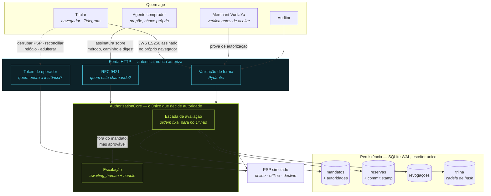
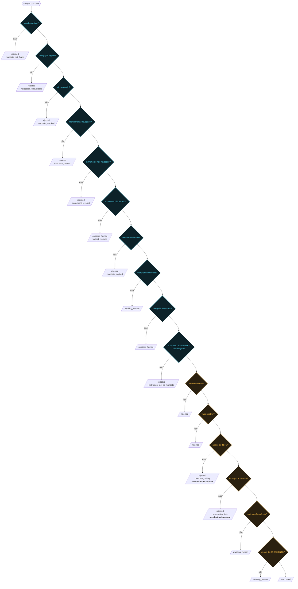
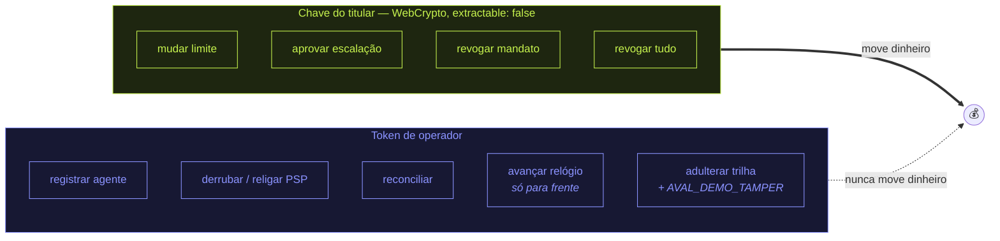
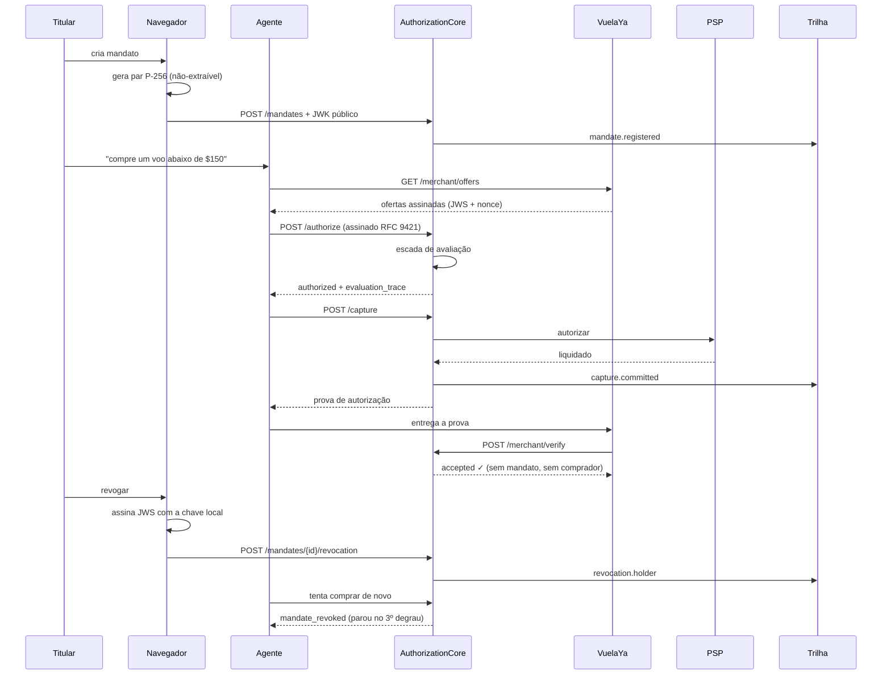
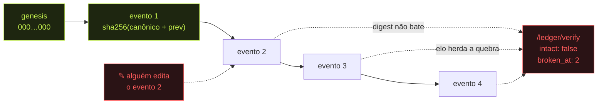
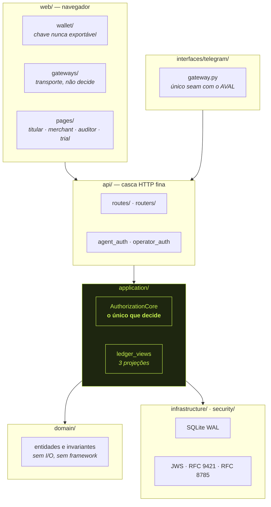

# Arquitetura do AVAL

Entregável do Mission Control. O PDF que vai no formulário é
[`architecture.pdf`](architecture.pdf), gerado deste arquivo — regenere depois de
qualquer edição, para que a imagem enviada e o documento versionado não divirjam:

```bash
uv run --with markdown python scripts/export_architecture.py
```

---

## A tese, em uma linha

**O LLM propõe. O núcleo determinístico dispõe. O modelo nunca está no caminho de
confiança.**

Todo o desenho abaixo existe para tornar essa frase verificável em vez de dita.

---

## Visão geral



A separação que mais importa está nas duas setas que saem do titular: uma leva uma
**assinatura**, a outra leva um **token de operador**. A primeira move dinheiro; a
segunda opera a instância e, de propósito, não move dinheiro nenhum.

---

## A escada de avaliação

A ordem **é** a regra. O núcleo para no primeiro degrau que falha, e os degraus abaixo
nunca são consultados — é isso que impede uma revogação de ser contornada por uma
compra pequena o bastante.



Dezesseis degraus, e a lista acima é a ordem literal de `_evaluate_with()`. Três deles
respondem perguntas que só existem porque o mandato nomeia um cartão e porque um agente
pode travar o orçamento sem gastar nada: **o cartão foi cancelado** (`instrument_revoked`),
**é o cartão certo** (`instrument_not_in_mandate`, checado só na captura, que é onde a
pergunta é real) e **sobrou vaga de reserva** (`reservation_limit`). Este último recusa em
vez de escalar de propósito: apertar aprovar não solta dinheiro que já está preso — quem
solta é `POST /reconcile`.

Em azul, autoridade. Em amarelo, dinheiro. **Autoridade sempre primeiro.** Cada decisão
devolve `evaluation_trace` com exatamente os degraus percorridos, e o front-end desenha
os não percorridos em cinza — a ausência é a evidência.

Três resultados, não dois: `authorized`, `awaiting_human` (fora do mandato mas
aprovável, com handle assinável) e `rejected` (teto, revogação, expiração — sem caminho
de volta, porque não há o que aprovar).

---

## As quatro autoridades

| pergunta | prova | quem detém |
|---|---|---|
| *quem está chamando?* | assinatura RFC 9421 | o agente |
| *esta compra pode acontecer?* | avaliação do mandato | ninguém: é determinística |
| *quem muda a autoridade de gasto?* | JWS ES256 | o titular (chave no navegador) |
| *quem opera a instância?* | token de operador | o time |



O relógio só avança porque rebobiná-lo reviveria um mandato expirado — e isso seria um
operador devolvendo autoridade de gasto.

---

## O circuito completo de uma compra



O merchant verifica sem receber `mandate_id` nem `principal_id`. A prova vincula
`checkout_id`, `merchant_id`, valor, moeda e `terms_hash` — e **omite** os dois. Um
recibo que vazasse o orçamento da compradora vazaria a compradora.

---

## A trilha que se defende



Cada evento canonicaliza a si mesmo (RFC 8785) e encadeia o digest do anterior. Não é
um log que o operador promete não editar — é um log que o auditor confere sem confiar
no operador. Com `AVAL_DEMO_TAMPER=1` o jurado quebra um elo e vê a posição ser
apontada. Não existe rota que conserte a cadeia.

---

## Camadas do código



O núcleo não sabe o que foi comprado — recebe `checkout_id` como string opaca. Produto,
oferta e liquidação vivem fora dele, o que é o que permite trocar o merchant sem tocar
em uma linha de regra de autorização.

---

## Fronteiras assumidas

Escolhas de demonstração, e defensáveis como tal:

- **SQLite** com WAL e `BEGIN IMMEDIATE`; repositórios atrás de portas para trocar por
  Postgres sem tocar no núcleo.
- **Custódia de chave em memória** no servidor. Em produção seria HSM/KMS, e a interface
  (`KeyCustodyService`) já é a que um HSM implementaria. A chave do **titular** já não
  vive no servidor: ela é do navegador.
- **PSP simulado**, controlável, para que a história de falha seja demonstrada e não
  narrada.
- **Sem PAN em lugar nenhum.** Não é que o cartão esteja bem guardado: ele nunca existe
  no sistema.
